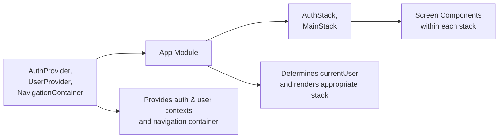

# App Module

## Overview
The App Module is the root entry point of the Expo Firebase Boilerplate. It initializes authentication and user contexts, sets up the React Navigation container, and conditionally renders either the authentication flow or the main application flow based on the user’s authentication state. It also displays a loading indicator while Firebase auth is initializing.

## Key Features
- **Authentication Initialization**: Wraps the application in `AuthProvider` to manage Firebase authentication state and expose `currentUser` and `loading`.
- **User Context Initialization**: Provides application-wide user data management through `UserProvider`.
- **Conditional Navigation**: Uses `AppNavigator` to switch between `AuthStack` (login/signup screens) and `MainStack` (authenticated screens) depending on whether `currentUser` is set.
- **Loading State Handling**: Renders a full-screen `ActivityIndicator` while the authentication context is resolving.

## System Errors
- **Missing Auth Context**  
  Description: Hooks like `useAuth()` return undefined or error out.  
  Resolution: Ensure `AuthProvider` is wrapping the root component before any usage of `useAuth()`.

- **Navigation Container Missing**  
  Description: Navigation methods (e.g., `navigate()`) fail with “No container found” errors.  
  Resolution: Wrap all navigators within `NavigationContainer`, as shown in the App Module.

- **Undefined User Context**  
  Description: Calls to user-related hooks throw “Context not found.”  
  Resolution: Confirm that `UserProvider` wraps components that call `useUser()` or other user hooks.

## Usage Examples

```javascript
// App.js
import React from 'react'
import { AuthProvider } from './context/AuthContext'
import { UserProvider } from './context/UserContext'
import { NavigationContainer } from '@react-navigation/native'
import AppNavigator from './AppNavigator'

export default function App() {
  return (
    <AuthProvider>
      <UserProvider>
        <NavigationContainer>
          <AppNavigator />
        </NavigationContainer>
      </UserProvider>
    </AuthProvider>
  )
}
```

```javascript
// AppNavigator.js
import React from 'react'
import { View, ActivityIndicator } from 'react-native'
import { createNativeStackNavigator } from '@react-navigation/native-stack'
import { useAuth } from '../context/AuthContext'
import MainStack from '../component/Navigation/MainStack'
import AuthStack from '../component/Navigation/AuthStack'

const Stack = createNativeStackNavigator()

export default function AppNavigator() {
  const { currentUser, loading } = useAuth()

  if (loading) {
    return (
      <View style={{ flex: 1, justifyContent: 'center', alignItems: 'center' }}>
        <ActivityIndicator size="large" />
      </View>
    )
  }

  return (
    <Stack.Navigator screenOptions={{ headerShown: false }}>
      {currentUser ? (
        <Stack.Screen name="Main" component={MainStack} />
      ) : (
        <Stack.Screen name="Auth" component={AuthStack} />
      )}
    </Stack.Navigator>
  )
}
```

## System Integration



This diagram illustrates how the App Module consumes upstream dependencies, applies its core logic, and exposes navigation flows to downstream screen components.