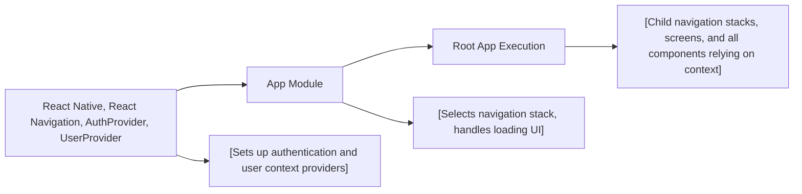

# App Module

## Overview
The **App Module** serves as the root entry point for the Expo Firebase boilerplate, orchestrating application initialization, authentication state management, and high-level navigation flows. It ensures that users are directed to appropriate application stacks (authenticated or unauthenticated) based on their authentication status, and sets up global context providers for authentication and user data.

## Key Features
- **Authentication State Routing**: Dynamically routes users to authenticated or unauthenticated navigation stacks based on their current authentication status.
- **Root Navigation Management**: Integrates React Navigation to manage the main navigation structure of the app.
- **Global Context Providers**: Automatically wraps the app with `AuthProvider` and `UserProvider`, making authentication and user information available throughout the component tree.
- **Loading State Handling**: Displays a global loading indicator while authentication state is being determined.

## System Errors
- **Authentication Loading Timeout**: If the authentication process takes unusually long or fails, users may remain on the loading spinner.  
  **Resolution**: Verify the connectivity to Firebase and correct configuration of the AuthProvider.
- **Navigation Error**: If navigation stack fails to initialize, the app may crash or become unresponsive.  
  **Resolution**: Ensure all navigation components (MainStack, AuthStack) are properly exported and configured.

## Usage Examples
Practical example of initializing and running the module in your Expo app:

```javascript
import React from 'react';
import { AppRegistry } from 'react-native';
import App from './App';

AppRegistry.registerComponent('main', () => App);
```

App automatically provides user routing and context providers—no additional setup is needed for navigation or authentication management outside this module.

## System Integration


