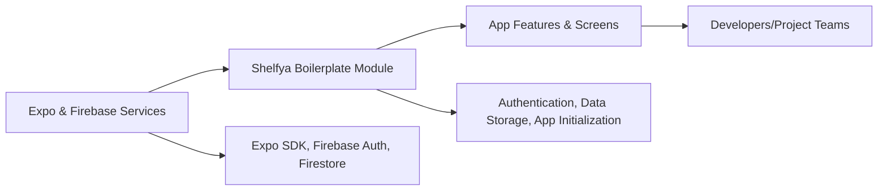

# Shelfya Module

## Overview
The Shelfya module serves as a foundational template built with Expo and Firebase, designed to accelerate the development of mobile applications with robust authentication, data storage, and cloud functionality. Its main purpose is to provide a pre-configured setup that integrates essential Firebase services with Expo's React Native stack, enabling developers to focus on building app features rather than basic infrastructure.

## Key Features
- **Firebase Authentication Integration**: Seamlessly handles user sign-in, sign-up, and session management through Firebase Authentication, supporting providers like email and Google.
- **Cloud Firestore Setup**: Provides out-of-the-box integration for real-time NoSQL data storage and retrieval using Firebase’s Cloud Firestore.
- **Secure Configuration Management**: Manages sensitive configuration details and environment variables for safe deployment and local development.
- **Expo SDK Compatibility**: Leverages Expo’s managed workflow for streamlined development, testing, and deployment of React Native apps.
- **Ready-to-Use File Structure**: Offers a sensible, modular file structure and best practices as a starting point for scalable codebases.

## System Errors
- **Firebase Configuration Error**: Occurs if environment variables or Firebase project settings are missing or malformed.
  - *Resolution*: Verify `.env` files and Firebase project credentials are correctly configured.
- **Authentication Failure**: User credentials are invalid or unsupported provider.
  - *Resolution*: Ensure the credentials match registered providers in your Firebase project and that OAuth settings are correct.

## Usage Examples

```javascript
// Example: Registering a new user with email and password using Firebase Auth

import { firebase } from '@react-native-firebase/auth';

async function registerUser(email, password) {
  try {
    const credential = await firebase.auth().createUserWithEmailAndPassword(email, password);
    // User registered and signed in
    return credential.user;
  } catch (error) {
    // Handle registration errors (e.g., email already in use)
    throw error;
  }
}

// Example: Saving user data to Firestore

import { firebase } from '@react-native-firebase/firestore';

async function saveUserData(userId, data) {
  await firebase.firestore().collection('users').doc(userId).set(data);
}
```

## System Integration

