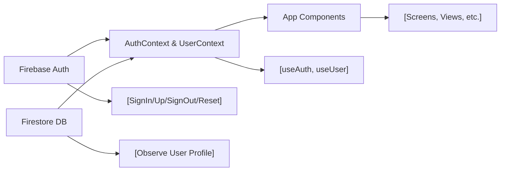

# Context APIs (AuthContext & UserContext)

## Overview
The context modules provide global authentication and user profile state management throughout the Expo-Firebase application. `AuthContext` centralizes authentication operations and status, while `UserContext` supplies current user profile data. By leveraging these providers, components across the app can securely access authentication state and user information without prop drilling or redundant API calls.

## Key Features

- **Authentication State Management (`AuthContext`)**:  
  Exposes current authentication status (`currentUser`), authentication workflows (sign in/up, sign out, password reset), and loading state during authentication events.

- **Authentication APIs**:  
  Provides methods (`signUp`, `signIn`, `logOut`, `resetPassword`) for account lifecycle built atop Firebase Authentication.

- **User Profile Observation (`UserContext`)**:  
  Makes available the complete, live-updated profile data (`profile`) for the current user by observing the user's document in Firestore.

- **Context Consumption Hooks**:  
  Supplies convenient hooks (`useAuth`, `useUser`) for accessing context values in any functional component, enabling granular or broad state access as required.

## System Errors

- **Authentication Failure**:  
  Occurs when signup, signin, or password reset calls return Firebase errors (e.g., invalid credentials, user not found).  
  *Resolution*: Check error messages from returned Promises, handle with UI feedback to the user. Ensure correct parameters and proper Firebase initialization.

- **Profile Data Not Found**:  
  Triggered if the Firestore document for the current user does not exist (`console.log("No such user!")`).  
  *Resolution*: Validate that user documents are created upon registration. Optionally, prompt to complete onboarding if profile data is missing.

- **Stale or Null Context Access**:  
  If components attempt to access context values outside of their respective Providers, hooks may return `undefined`.  
  *Resolution*: Always wrap consuming components within `AuthProvider` and `UserProvider` as high as possible in the component tree.

## Usage Examples

```jsx
// App.js (Wrapping app with Providers)
import { AuthProvider } from './context/AuthContext';
import { UserProvider } from './context/UserContext';

export default function App() {
  return (
    <AuthProvider>
      <UserProvider>
        {/* App contents here */}
      </UserProvider>
    </AuthProvider>
  );
}

// Consuming authentication in a component
import { useAuth } from './context/AuthContext';

function LoginScreen() {
  const { signIn, loading, currentUser } = useAuth();

  const handleLogin = async (email, password) => {
    try {
      await signIn(email, password);
      // handle success
    } catch (e) {
      // handle error
    }
  };

  // UI using loading/currentUser state
}

// Consuming user profile in a component
import { useUser } from './context/UserContext';

function ProfileScreen() {
  const { profile } = useUser();
  return <Text>{profile.displayName}</Text>;
}
```

## System Integration


