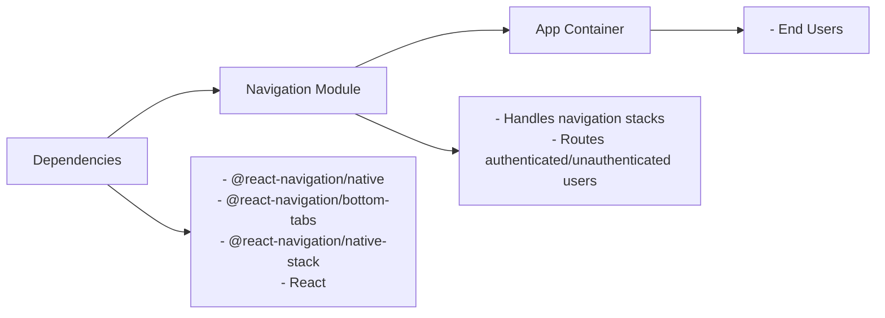

# Navigation Module

## Overview
The Navigation module manages navigation flows within the application, providing structured stack and tab navigation for both authenticated and unauthenticated users. It enables seamless transitions between key screens (Home, Browse, Profile, Sign Up, Sign In) depending on user authentication status, ensuring the right layout and navigation experience for each user journey.

## Key Features
- **MainStack (Authenticated User Navigation)**: Presents bottom tab navigation for signed-in users, granting quick access to Home, Browse, and Profile screens.
- **AuthStack (Authentication Flow Navigation)**: Guides unauthenticated users through First, Sign Up, and Sign In screens using a stack-based workflow.
- **Custom Tab Bar Icons**: Enhances UX by displaying SVG icons for each tab in the MainStack.
- **Conditional Routing**: Supports structured routing based on user's authentication status within the app.

## System Errors
- **Unknown Screen Name**: If a screen defined in the navigator doesn't match an actual component or is misspelled (e.g., `FirstPage` vs `FirstScreen`), navigation will fail.  
  *Resolution*: Ensure defined screen names and components match and exist.
- **Missing Component Imports**: If a required screen component is not imported or defined, navigation will throw an error on render.  
  *Resolution*: Confirm that all components are correctly imported and exist.

## Usage Examples
Practical usage for integrating both navigation stacks in your app:

```javascript
// App.js (example integration)
import React from 'react';
import { NavigationContainer } from '@react-navigation/native';
import MainStack from './component/Navigation/MainStack';
import AuthStack from './component/Navigation/AuthStack';

export default function App({ isAuthenticated }) {
  return (
    <NavigationContainer>
      {isAuthenticated ? <MainStack /> : <AuthStack />}
    </NavigationContainer>
  );
}
```

## System Integration

