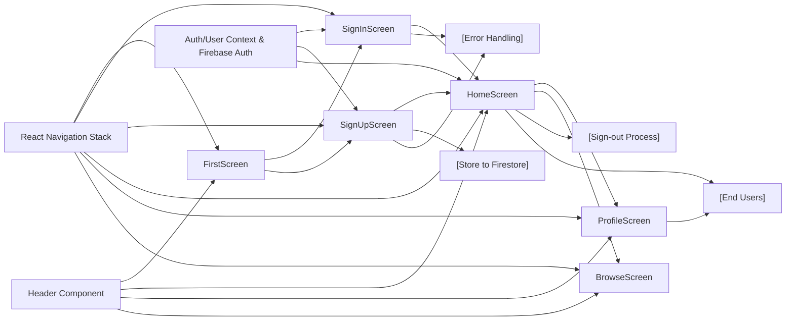

# App Screen Modules Overview

## Overview
The screen modules form the core user navigation and interaction points in the app. They manage routing between authentication flows (sign in, sign up), user profile access, browsing features, and home/dashboard experience. Each screen acts as a visual and stateful layer, orchestrating navigation and exposing different parts of the application's main features, while coordinating with reusable components (such as the header) and authentication and user context providers.

## Key Features

- **Onboarding & Entry (FirstScreen)**: Provides users with a welcoming interface to choose between sign-up and sign-in flows, guiding new and existing users through authentication entry points.
- **Authentication (SignInScreen, SignUpScreen)**: Handles user login and account creation. These screens manage user input, validation, error messages, and navigation on success. SignUp also stores profile information in the backend.
- **Home Dashboard (HomeScreen)**: Acts as the authenticated user's starting page, displaying a personalized greeting using user context and offering a secure sign-out function.
- **Profile Display (ProfileScreen)**: Placeholder for accessing and viewing user details or settings (structure in place for expansion).
- **Content Browsing (BrowseScreen)**: Placeholder screen for future content discovery features, illustrating the navigational structure.
- **Reusable UI (Header component)**: Provides a common header section for use across screens, supporting interface consistency.

## System Errors

- **Authentication Errors**:
    - *auth/invalid-credential*: Invalid email/password combination. Resolution: Prompt the user to check credentials.
    - *auth/email-already-in-use*: Attempted to sign up with an existing email. Resolution: Inform the user and suggest password reset or sign in.
    - *auth/invalid-email*: Malformed email input. Resolution: Request user correction.
    - *auth/weak-password*: Password is too weak (e.g., less than 6 characters). Resolution: Explain password requirements.
- **Network/Backend Errors**:
    - *Firestore/User Creation Failure*: Error when storing user profile. Resolution: Retry or display a notification to the user.
- **Input Validation Errors**:
    - Missing required fields. Resolution: Prompt user to fill in necessary input and highlight the field.

## Usage Examples

```javascript
// Navigate from FirstScreen to SignUp
navigation.navigate('SignUp')

// Sign in a user and go to Main app flow
signIn(email, password)
  .then(() => navigation.reset({ index: 0, routes: [{ name: 'Main' }] }))

// Sign up a user, store details, and redirect
signUp(email, password)
  .then(userCred => setDoc(doc(FB_DB, 'users', userCred.user.uid), { FirstName: firstName, LastName: lastName }))
  .then(() => navigation.reset({ index: 0, routes: [{ name: 'Main' }] }))

// Sign out from HomeScreen and return to Auth stack
signOut(FB_AUTH)
  .then(() => navigation.reset({ index: 0, routes: [{ name: 'Auth' }] }))
```

## System Integration

