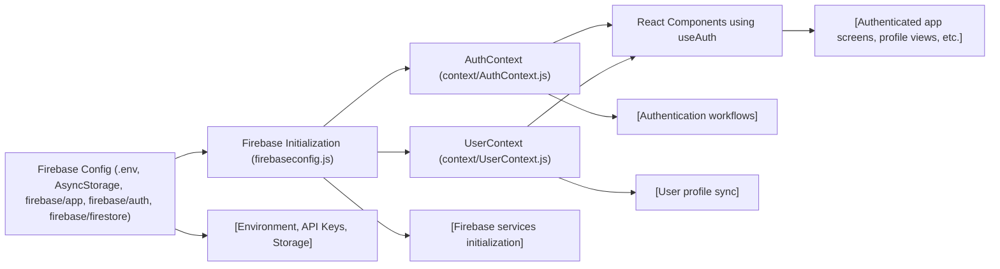

# Expo Firebase API Overview

## Overview
This module provides a unified interface to Firebase services (Authentication, Firestore, and Storage) integrated with an Expo React Native application. It centralizes authentication state, user management, and real-time user profile access for seamless backend communication across the app.

## Key Features
- **Firebase Initialization**: Centralizes the configuration and initialization of Firebase services (Auth, Firestore, Storage) with React Native compatible persistence.
- **Authentication Context**: Offers app-wide access to authentication state, sign-in/up, sign-out, and password reset features using context providers.
- **User Profile Context**: Streams real-time user profile data from Firestore as a React Context, updating subscribed components automatically when user data changes.
- **Async Storage Integration**: Ensures authentication state is persisted using React Native's AsyncStorage, supporting robust login sessions on mobile devices.
- **Public React Context APIs**: Supplies easy-to-use hooks (`useAuth`, `useUser`) for accessing authentication and user profile data throughout the component tree.

## System Errors
- **Invalid Credentials**: Triggered during sign-in/sign-up with invalid email/password. Usually results in a Firebase-auth error; resolve by checking input validity and displaying error messages.
- **Network/Permission Issues**: Errors may occur if the app fails to connect to Firebase, or if read/write permissions to Firestore are misconfigured. Ensure Firebase credentials are valid and security rules are set appropriately.
- **No User Profile Document**: If a signed-in user's profile document does not exist in Firestore, components may receive empty or incomplete profile state. Solution: Ensure all new users have a default profile created upon registration.
- **Session Expiry**: Auth tokens can expire or be revoked, resulting in forced sign-outs. The system automatically updates and removes auth state; users must re-authenticate.

## Usage Examples

```javascript
// Example: Authentication - Register, Login, Logout, and Reset Password
import { useAuth } from '../context/AuthContext';

const { signUp, signIn, logOut, resetPassword, currentUser } = useAuth();

// Register a new user
await signUp('user@example.com', 'password123');

// Login an existing user
await signIn('user@example.com', 'password123');

// Logout
await logOut();

// Send password reset
await resetPassword('user@example.com');

// Access current user's info
console.log(currentUser);

// Example: Accessing the current user's Firestore profile
import { useUser } from '../context/UserContext';

const { profile } = useUser();

console.log(profile.displayName); // Assuming your user profile stores a displayName
```

## System Integration


