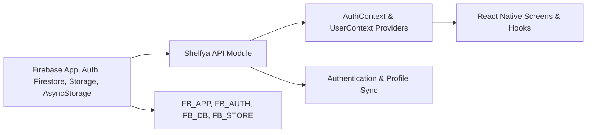

# Shelfya API Overview

## Overview
This module initializes and exposes Firebase services (Authentication, Firestore, Storage) with React Native persistence and provides React Context providers for managing user authentication and profile data in an Expo-based application.

## Key Features
- **Firebase Initialization**: Sets up Firebase App, Auth, Firestore, and Storage using environment configurations and AsyncStorage persistence for authentication state.
- **AuthContext Provider**: Supplies authentication methods (sign-up, sign-in, sign-out, password reset) along with the current user state and loading indicator to the React component tree.
- **useAuth Hook**: Custom hook to access AuthContext values:  
  • `currentUser` – the authenticated user object or null  
  • `signUp(email, password)` – create a new user  
  • `signIn(email, password)` – authenticate an existing user  
  • `logOut()` – sign out the current user  
  • `resetPassword(email)` – send a password reset email  
  • `loading` – boolean flag indicating auth state initialization  
- **UserContext Provider**: Listens for real-time updates to the Firestore user document and exposes a normalized `profile` object.
- **useUser Hook**: Custom hook to access UserContext values:  
  • `profile` – the Firestore-backed user profile with basic fields and `uid`

## System Errors
- **AuthenticationError**: Thrown by Firebase Auth operations (e.g., invalid email, wrong password).  
  Resolution: Inspect `error.code`, show user-friendly messages, and verify credentials.
- **FirestorePermissionError**: Occurs when the authenticated user lacks read/write rights on the Firestore document.  
  Resolution: Adjust Firestore security rules to grant the correct permissions.
- **UserDocumentNotFound**: Logged when no Firestore document exists for the authenticated user.  
  Resolution: Ensure a user profile document is created upon sign-up.

## Usage Examples
```javascript
// App.js
import React from 'react';
import { AuthProvider, useAuth } from './.shelfya/api';     // Path to AuthContext exports
import { UserProvider, useUser } from './.shelfya/api';     // Path to UserContext exports

function App() {
  return (
    <AuthProvider>
      <UserProvider>
        <MainScreen />
      </UserProvider>
    </AuthProvider>
  );
}

function MainScreen() {
  const { currentUser, signIn, logOut, loading } = useAuth();
  const { profile } = useUser();

  if (loading) return <LoadingSpinner />;
  if (!currentUser) return <LoginScreen onSignIn={signIn} />;

  return (
    <HomeScreen
      userEmail={currentUser.email}
      userProfile={profile}
      onSignOut={logOut}
    />
  );
}
```

## System Integration
