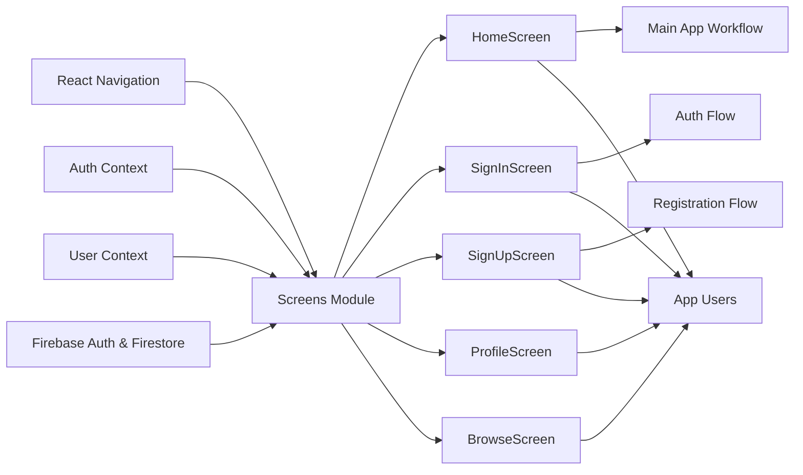

# Screens Module

## Overview

The **Screens Module** manages user-facing interfaces and navigational flows within the application. Each screen represents a key user journey stage (e.g., onboarding, authentication, main content) and connects with system features such as authentication, navigation, and user data. It forms the foundation for all user interactions, routing users based on authentication state and actions.

## Key Features

- **Onboarding (FirstScreen)**: Welcomes users and guides them to sign in or register. Entry point for unauthenticated users.
- **User Sign-In (SignInScreen)**: Handles user authentication via email and password, supports error messaging and navigation to registration or password recovery.
- **User Registration (SignUpScreen)**: Facilitates new user account creation, inputs validation, and stores extra profile information in backend database.
- **Home Screen (HomeScreen)**: Main landing page post-authentication. Displays personal greetings and provides user sign-out functionality.
- **User Profile (ProfileScreen)**: Placeholder for displaying and managing user's profile data (future extension).
- **Content Browsing (BrowseScreen)**: Placeholder for displaying available content or items for the user to explore (future extension).

## System Errors

- **Invalid Credentials (SignInScreen)**:  
  *Description*: Occurs when the provided email or password is incorrect.  
  *Resolution*: User should verify email and password, and retry.
- **Email Already In Use (SignUpScreen)**:  
  *Description*: Attempt to register with an email that already exists in the system.  
  *Resolution*: User should use another email address or recover the existing account.
- **Invalid Email / Weak Password (SignUpScreen)**:  
  *Description*: Email format is invalid or password does not meet minimum (e.g., 6 chars) requirements.  
  *Resolution*: User must input a valid email address and a stronger password.
- **Empty or Missing Fields**:  
  *Description*: Any required field left blank during registration/sign-in leads to an immediate validation prompt.  
  *Resolution*: User must fill in all required fields to proceed.

## Usage Examples

```jsx
// Navigating from onboarding screen
<FirstScreen navigation={navigation} />

// Signing in a user
<SignInScreen />

// Registering a new user
<SignUpScreen />

// Displaying home after login
<HomeScreen />

// Navigating to profile and browse pages
<ProfileScreen />
<BrowseScreen />
```

## System Integration


