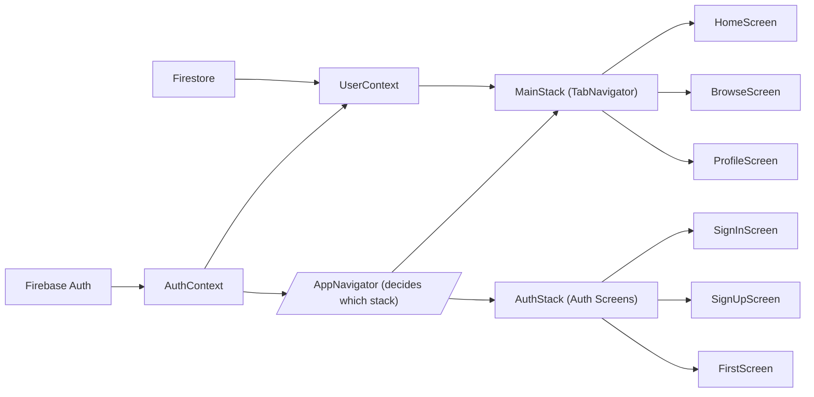

# Application Architecture

## Overview
This module defines the overall application architecture for the Expo-Firebase boilerplate. It orchestrates authentication, user context, and navigation stacks to manage how users flow through the app based on their authentication state. The architecture ensures seamless integration with Firebase Authentication and Firestore for user profile management, and uses React Navigation for user-friendly screen transitions.

## Key Features

- **Conditional Navigation**: Dynamically displays either authentication screens (sign-in/sign-up) or the main app navigation, based on the current authentication state.
- **Authentication Context**: Provides a global context for authentication state and common auth actions (sign in, sign up, logout, password reset) using Firebase Auth.
- **User Context**: Fetches and stores user profile data from Firestore, making it accessible throughout the app for the authenticated user.
- **Stack & Tab Navigation**: Uses stacked navigation for authentication and tabbed navigation for main app features (Home, Browse, Profile).
- **Seamless State Propagation**: Automatically updates UI and available navigation paths as authentication status or user data changes.

## System Errors

- **Authentication Errors**: Failures during sign in, sign up, or password resetting (e.g., invalid email, wrong password, network error).
  - **Resolution**: Catch errors from AuthContext methods and display appropriate messages to users. Ensure Firebase project configuration is correct.
- **User Data Fetching Errors**: Errors while fetching user profile data (e.g., Firestore permissions, missing user document).
  - **Resolution**: Check network connectivity, verify Firestore security rules, confirm user exists in 'users' collection.
- **Loading State Issues**: Application showing infinite loader due to unresolved authentication state.
  - **Resolution**: Ensure `onAuthStateChanged` is firing and that Firebase is initialized properly.

## Usage Examples

```javascript
import React from 'react';
import { useAuth } from './context/AuthContext';
import { useUser } from './context/UserContext';

// To access authentication state and actions:
const { currentUser, signIn, signUp, logOut } = useAuth();

// To access current user profile:
const { profile } = useUser();

// Example usage in a component:
function ProfileInfo() {
  const { profile } = useUser();
  return <Text>{profile.displayName}</Text>;
}

// Navigation works automatically depending on auth state as set up in App.js
```

## System Integration


This architecture ensures a responsive and context-aware user experience, integrating Firebase services for authentication and user management with navigation that adapts automatically to user state changes.