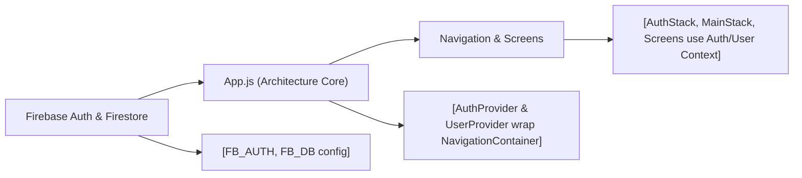

# Expo-Firebase App Architecture

## Overview
This document describes the feature-centric architecture of the Expo-Firebase Boilerplate app. The system serves as a template for React Native applications using Firebase for user authentication and profile management. It provides structured navigation flows for authenticated and unauthenticated users, centralizes authentication and user state management, and integrates these concerns with the application’s screen stacks and navigation.

## Key Features
- **Authentication Flow Management**: Seamlessly switches between authentication (sign-in, sign-up, password reset) and main app screens based on user authentication state.
- **AuthContext Provider**: Exposes methods (`signUp`, `signIn`, `logOut`, `resetPassword`) and current auth state to the app via React Context, integrating with Firebase Authentication.
- **UserContext Provider**: Listens to changes in the authenticated user’s Firestore profile, making user data globally accessible across the app.
- **Modular Navigation Structure**:
  - **AuthStack**: Stacks for unauthenticated users (welcome, sign-in, sign-up).
  - **MainStack**: Tab navigator for authenticated users (home, browse, profile).
- **Centralized Loading Handling**: Displays a loading spinner while authentication state is determined on app startup, ensuring smooth user experience.

## System Errors
- **Authentication Failure**: When sign-in or sign-up fails (e.g., wrong credentials, network issues).
  - **Resolution**: Display relevant error message to user; check Firebase status and credentials.
- **No User Profile Found**: If authenticated but Firestore profile does not exist.
  - **Resolution**: Display a fallback state or prompt for profile creation; ensure user creation logic includes profile setup.
- **Network or Firebase Connectivity Issues**: When communication with Firebase services fails.
  - **Resolution**: Check internet connection; confirm Firebase configuration; handle errors in UI.

## Usage Examples

```javascript
// Access authentication state and methods anywhere in the app:
import { useAuth } from './context/AuthContext';

function LoginButton() {
  const { signIn } = useAuth();
  return (
    <Button onPress={() => signIn('user@example.com', 'password123')}>
      Log In
    </Button>
  );
}

// Access current user profile anywhere after login:
import { useUser } from './context/UserContext';

function ProfileScreen() {
  const { profile } = useUser();
  return (
    <Text>Welcome, {profile.displayName}!</Text>
  );
}

// Navigation switching between auth and main flows (handled automatically)
export default function App() {
  return (
    <AuthProvider>
      <UserProvider>
        <NavigationContainer>
          <AppNavigator />
        </NavigationContainer>
      </UserProvider>
    </AuthProvider>
  );
}
```

## System Integration



**Legend**:
- **Firebase Auth & Firestore**: Core backend services for authentication and user profile data.
- **App.js (Architecture Core)**: Initializes providers, determines which navigation flow to show.
- **AuthProvider & UserProvider**: Context providers enable global access to authentication state and user profile.
- **Navigation & Screens**: Consume contexts, render appropriate stacks (`AuthStack` or `MainStack`) based on user state.
- **Screens**: Individual feature screens access user info and authentication functions as needed.