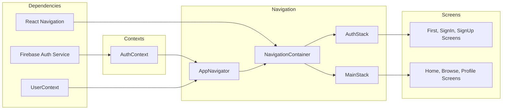

# App Navigation and Authentication Architecture

## Overview
This module orchestrates user authentication and navigation flow in the Expo–Firebase boilerplate. It uses an authentication context to track user state and conditionally renders either the authentication stack (for sign-in/up screens) or the main bottom-tab stack (for core app screens). The `AuthProvider` and `UserProvider` wrap the navigation container to supply authentication and user data throughout the app.

## Key Features
- **AuthContext Integration**: Provides `currentUser`, `loading`, and authentication methods (`signUp`, `signIn`, `resetPassword`, `logOut`) across the app.
- **Dynamic Navigation Routing**: `AppNavigator` inspects `currentUser` and `loading` to switch between `AuthStack` and `MainStack`.
- **AuthStack**: A native-stack navigator serving unauthenticated screens:
  - FirstScreen
  - SignUpScreen
  - SignInScreen
- **MainStack**: A bottom-tab navigator serving authenticated screens:
  - HomeScreen
  - BrowseScreen
  - ProfileScreen
- **Context Composition**: `AuthProvider` and `UserProvider` are composed at the root to supply authentication and user profile data globally.

## System Errors
- **INVALID_AUTH_CREDENTIALS**  
  Description: Occurs when email/password are incorrect during sign-in or sign-up.  
  Resolution: Prompt the user to verify their credentials or reset the password.

- **NETWORK_UNAVAILABLE**  
  Description: Firebase calls fail due to network issues.  
  Resolution: Check device connectivity and retry operations when the network is restored.

- **USER_STATE_NOT_READY**  
  Description: `AppNavigator` is rendered before auth-state initialization.  
  Resolution: The `loading` flag prevents rendering until the initial `onAuthStateChanged` callback completes.

## Usage Examples
```javascript
// App.js
import React from 'react';
import { NavigationContainer } from '@react-navigation/native';
import { AuthProvider } from './context/AuthContext';
import { UserProvider } from './context/UserContext';
import AppNavigator from './AppNavigator';

export default function App() {
  return (
    <AuthProvider>
      <UserProvider>
        <NavigationContainer>
          <AppNavigator />
        </NavigationContainer>
      </UserProvider>
    </AuthProvider>
  );
}

// Inside any screen component
import React from 'react';
import { View, Button } from 'react-native';
import { useAuth } from '../context/AuthContext';

export default function ProfileScreen() {
  const { currentUser, logOut } = useAuth();

  return (
    <View>
      <Text>Welcome, {currentUser.email}</Text>
      <Button title="Sign Out" onPress={logOut} />
    </View>
  );
}
```

## System Integration
