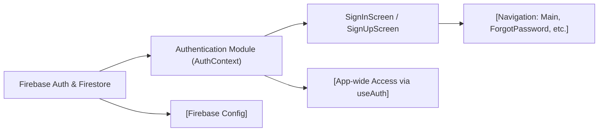

# Authentication Module

## Overview
The Authentication module centralizes user authentication features for the application, enabling account creation, sign-in, sign-out, and password reset workflows. It provides a context-driven approach for accessing authentication state and methods throughout the React Native application, interfacing directly with Firebase Authentication. It also supports seamless integration with user registration flows and protected sections of the app that require authenticated access.

## Key Features

- **Authentication Context Provider**: Supplies authentication state (`currentUser`, `loading`) and methods (signIn, signUp, logOut, resetPassword) to the React component tree via context, ensuring consistent access from any screen.
- **Sign Up Workflow**: Enables new users to register using email and password, also storing additional profile information (first and last names) in Firestore.
- **Sign In Workflow**: Allows registered users to authenticate using their credentials, updating the app state accordingly and handling navigation post-login.
- **Password Reset**: Provides a mechanism for users to initiate a password reset process through their email.
- **Sign Out**: Cleanly logs out the current user and updates all reliant UI.
- **Error Handling & Validation**: Offers user-friendly error messages for common authentication issues (e.g., invalid credentials, duplicate accounts, weak passwords).

## System Errors

- **Invalid Credential**:  
  _Description_: Triggered when the email or password is incorrect.  
  _Resolution_: Notify the user and prompt for correct credentials.

- **Email Already In Use**:  
  _Description_: Attempted registration with an email that already exists.  
  _Resolution_: Prompt user to use a different email or log in if they already have an account.

- **Invalid Email**:  
  _Description_: Provided email does not meet validation requirements.  
  _Resolution_: Ask the user to check and re-enter a correctly formatted email address.

- **Weak Password**:  
  _Description_: Password does not meet minimum security requirements (at least 6 characters for Firebase).  
  _Resolution_: Advise the user to provide a stronger password.

- **Network or Unknown Error**:  
  _Description_: Generic or network-related failures.  
  _Resolution_: Show a general error message and ask the user to retry.

## Usage Examples

```javascript
// Accessing authentication features from any component
import { useAuth } from '../context/AuthContext';

// Signing up a new user
const { signUp } = useAuth();
signUp('user@example.com', 'password123')
  .then(userCredential => {
    // Handle further user setup, e.g., saving profile in Firestore
  })
  .catch(error => {
    // Handle error states (see System Errors)
  });

// Signing in
const { signIn } = useAuth();
signIn('user@example.com', 'password123')
  .then(() => {
    // Navigate to main application screen
  })
  .catch(error => {
    // Handle error (invalid credentials, etc.)
  });

// Password reset
const { resetPassword } = useAuth();
resetPassword('user@example.com')
  .then(() => {
    // Inform user to check their email
  })
  .catch(error => {
    // Handle error
  });

// Logging out
const { logOut } = useAuth();
logOut()
  .then(() => {
    // UI will automatically update to reflect logged out state
  });
```

## System Integration



**Explanation**:  
- The Authentication Module (`AuthContext`) wraps the app and exposes authentication state/methods via useAuth.
- It integrates directly with Firebase Auth for user management and Firestore for profile storage.
- UI screens (`SignInScreen`, `SignUpScreen`) interact with the module for login, registration, and error handling.
- Navigation flows rely on the authentication state to determine access to main or protected screens.