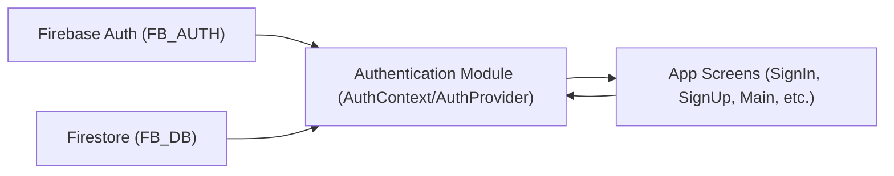

# Authentication Module

## Overview
The Authentication module manages user login, registration, and session state throughout the Expo-Firebase application. It centralizes authentication logic and state via React Context, ensuring all screens have streamlined access to user identity, sign-in/sign-up functionality, and session management. This module is also responsible for integrating with Firebase Authentication and coordinating user data persistence after sign-up.

## Key Features
- **Centralized Auth State**: React Context provides the current user and authentication status globally to all app components, avoiding prop-drilling and redundant checks.
- **Sign In**: Allows users to log in using email and password credentials via Firebase Authentication.
- **Sign Up**: Handles new user registration with email and password, and persists additional user data (first/last name) to Firestore.
- **Password Reset**: Exposes a flow for users to request password reset emails.
- **Sign Out**: Cleans up authentication session and updates application state accordingly.
- **Persistent Session Listening**: Monitors authentication state changes in Firebase to keep the app's user context in sync.
- **Error Handling**: Provides clear error messages for common registration and login failures.

## System Errors
- **Invalid Credentials**:  
  *Description*: Triggered when the email or password entered during login is incorrect (`auth/invalid-credential`).  
  *Resolution*: Display a generic error message to the user and prompt for correction.

- **Email Already In Use**:  
  *Description*: When signing up, this error (`auth/email-already-in-use`) occurs if the user’s email already exists in Firebase.  
  *Resolution*: Prompt user to log in instead or use another email.

- **Invalid Email Format**:  
  *Description*: Triggers (`auth/invalid-email`) if the email is not a valid format.  
  *Resolution*: Ask the user to correct the email format.

- **Weak Password**:  
  *Description*: After attempting registration with a password under six characters (`auth/weak-password`).  
  *Resolution*: Inform the user of the password requirements.

- **Required Fields Missing**:  
  *Description*: Local validation errors when required fields (email, password, first or last name) are empty.  
  *Resolution*: Highlight form errors and prompt the user to complete all fields.

## Usage Examples

```javascript
// Accessing Auth Context in a screen or component
import { useAuth } from '../context/AuthContext';

const { signIn, signUp, logOut, currentUser } = useAuth();

// Signing In
signIn(email, password)
  .then(() => /* handle navigation to main app */)
  .catch((error) => /* display authentication error */);

// Signing Up (with additional profile information in Firestore)
signUp(email, password)
  .then((userCredential) => {
    // persist extra user info using Firestore
    return setDoc(doc(FB_DB, 'users', userCredential.user.uid), {
      FirstName: firstName,
      LastName: lastName
    });
  });

// Signing Out
logOut()
  .then(() => /* redirect to sign-in screen or home */);

// Resetting Password
resetPassword(email)
  .then(() => /* inform user to check email for reset link */);

// Reading Current User
if (currentUser) {
  console.log('User is logged in:', currentUser.email);
}
```

## System Integration



- The Authentication Module (AuthContext/AuthProvider) acts as a mediator between Firebase services (Authentication and Firestore) and the application screens.
- App screens consume authentication hooks (e.g., `useAuth()`) to perform auth operations.
- User registration not only uses Firebase Auth but also stores profile details in Firestore after credential creation.
- State updates and error handling propagate back to screens for user feedback and navigation decisions.