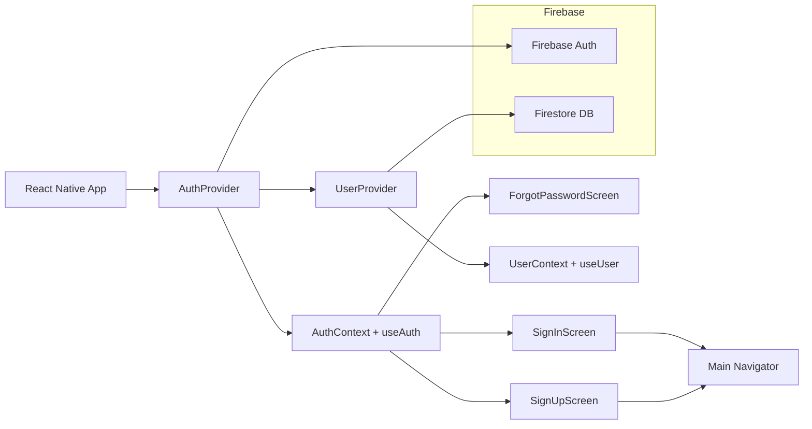

# Authentication Module

## Overview
This module centralizes user authentication and profile management across the app. It provides React Context providers and hooks to sign users up, sign them in, reset passwords, sign out, and stream user profile data from Firestore. It relies on Firebase Auth for credentials and Firestore for user metadata.

## Key Features
- **AuthProvider**  
  Wraps the app to expose authentication state (`currentUser`, `loading`) and actions (`signIn`, `signUp`, `resetPassword`, `logOut`) via the `useAuth` hook.

- **useAuth**  
  Hook to access authentication state and methods:
  - `currentUser`: Firebase user object or null
  - `loading`: boolean indicating auth state initialization
  - `signIn(email, password)`: authenticates existing users
  - `signUp(email, password)`: creates a new user account
  - `resetPassword(email)`: sends password reset email
  - `logOut()`: signs the user out

- **UserProvider**  
  Subscribes to the authenticated user’s Firestore document (`users/{uid}`) and exposes the real-time `profile` object via the `useUser` hook.

- **useUser**  
  Hook to access the current user’s Firestore profile data:
  - `profile`: latest user metadata (first name, last name, uid)

## System Errors
- **auth/email-already-in-use**  
  Occurs during `signUp` if the email is already registered.  
  Resolution: Prompt user to choose a different email or sign in instead.

- **auth/invalid-email**  
  Occurs during `signIn` or `signUp` if the email format is incorrect.  
  Resolution: Validate email format before calling the API.

- **auth/weak-password**  
  Occurs during `signUp` if the password is shorter than 6 characters.  
  Resolution: Enforce a minimum password length in the UI before submission.

- **auth/invalid-credential**  
  Occurs during `signIn` if email/password combination is wrong.  
  Resolution: Show a generic “incorrect email or password” message.

- **Firestore “No such user!”**  
  Logged when the Firestore document for an authenticated user does not exist.  
  Resolution: Ensure user documents are created right after `signUp`.

## Usage Examples

```jsx
// Wrap your app entrypoint
import React from 'react';
import { AuthProvider } from './context/AuthContext';
import { UserProvider } from './context/UserContext';

export default function App() {
  return (
    <AuthProvider>
      <UserProvider>
        <NavigationContainer>{/* screens go here */}</NavigationContainer>
      </UserProvider>
    </AuthProvider>
  );
}
```

```jsx
// Signing in a user
import React, { useState } from 'react';
import { useAuth } from './context/AuthContext';

function SignInForm() {
  const { signIn } = useAuth();
  const [email, setEmail] = useState('');
  const [password, setPassword] = useState('');

  const handleSubmit = () => {
    signIn(email, password)
      .then(() => console.log('Signed in'))
      .catch(err => console.error(err));
  };

  return (
    // UI inputs bound to email/password, and call handleSubmit on press
  );
}
```

```jsx
// Accessing the user profile
import React from 'react';
import { useUser } from './context/UserContext';

function ProfileHeader() {
  const { profile } = useUser();
  return <Text>Welcome, {profile.FirstName} {profile.LastName}</Text>;
}
```

## System Integration

