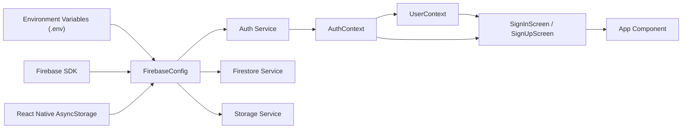

# Firebase Integration

## Overview
The Firebase Integration module connects your Expo React Native app to Firebase services, providing seamless user authentication, profile storage, and data access. It orchestrates authentication state management, Firestore data synchronization, and secure storage of user credentials. This integration forms the backbone for user sign-in, sign-up, and persistent profile data throughout the application.

## Key Features

- **Firebase Initialization**: Centralizes Firebase configuration (Auth, Firestore, Storage) for use throughout the app, leveraging environment variables for sensitive credentials.
- **Authentication Context**: Provides a global state and API for user authentication (sign-in, sign-up, sign-out, password reset), tracking authentication status reactively across the app.
- **User Profile Synchronization**: Retrieves and keeps user profile data from Firestore in sync, providing the user object to all components that need profile information.
- **Sign-In/Sign-Up Flows**: User interfaces for secure sign-in and sign-up, with validation and error messaging, based on the centralized AuthContext API.
- **Persistence with AsyncStorage**: Ensures that authentication state persists across app reloads for a smooth user experience.

## System Errors

- **auth/email-already-in-use**: Triggered on sign-up if the email is already registered.  
  _Resolution_: Inform the user to use a different email or to sign in instead.

- **auth/invalid-email**: Indicates malformed email addresses during sign-up.
  _Resolution_: Prompt user to check the email format.

- **auth/weak-password**: Password doesn’t meet minimum security requirements.
  _Resolution_: Show an error that password must have at least 6 characters.

- **auth/invalid-credential**: Incorrect email/password during sign-in.
  _Resolution_: Display a user-friendly message about incorrect credentials.

- **No user document in Firestore**: Occurs if a profile document is missing.
  _Resolution_: Inform the user or create the profile document as needed.

- **Network/Firestore errors**: General connectivity or permission issues.
  _Resolution_: Show an error and suggest checking connection or permissions.

## Usage Examples

```javascript
// Accessing authentication state and methods from AuthContext
import { useAuth } from '../context/AuthContext';

function MyComponent() {
  const { currentUser, signIn, signUp, logOut } = useAuth();

  // Example Sign In:
  signIn('john@example.com', 'password123')
    .then(() => { /* Navigate to main app screen */ })
    .catch(err => { /* Handle error (show user message) */ });

  // Example Sign Up:
  signUp('jane@example.com', 'pAssword!')
    .then(userCredential => {/* Further setup, e.g., create Firestore user doc */});
}

// Accessing profile data from UserContext
import { useUser } from '../context/UserContext';

function ProfileScreen() {
  const { profile } = useUser();

  // Use profile.FirstName, profile.LastName, etc., in your component
}
```

## System Integration



**Legend:**
- **Environment Variables**: Securely supply credentials at runtime.
- **firebaseconfig**: Initializes Firebase core services with persistence.
- **AuthContext/UserContext**: Provide authentication and user profile state globally.
- **Screens**: Use the context APIs for user interaction.
- **App Component**: The root that ties all providers and screens together.