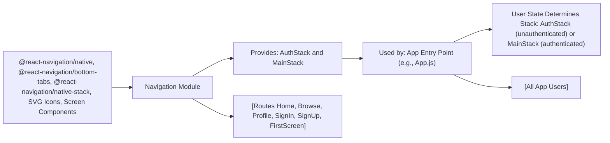

# Navigation Module

## Overview
The Navigation module manages the screen flow and user journeys within the application, providing organized navigation stacks for both authenticated and unauthenticated users. By integrating with React Navigation, it separates the app's main content (after login) from onboarding and authentication screens, ensuring users see the appropriate UI based on their authentication state.

## Key Features
- **Authenticated Stack (MainStack)**: Presents the bottom tab navigation for primary app features—Home, Browse, and Profile—available to logged-in users.
- **Authentication Stack (AuthStack)**: Manages onboarding, sign-up, and sign-in screens, ensuring users can access authentication flows seamlessly.
- **Tab Navigation with Custom Icons**: Uses SVG icons in the bottom tab bar for a modern and intuitive navigation experience.
- **Route Isolation**: Keeps authentication routes and main application routes separate, enhancing maintainability and security.

## System Errors
- **Navigation Misconfiguration**: If the navigation structure is not properly integrated into the app's root (e.g., NavigationContainer missing), app might not render screens, showing a blank page.  
  _Resolution_: Ensure the Navigation module is wrapped with the main NavigationContainer and provided at the app root.
- **Component Mapping Errors**: If a screen name or component provided does not exist or is misspelled, navigation actions may fail or cause errors.  
   _Resolution_: Double-check that all referenced screen components are properly implemented and exported.
- **Incorrect Initial Route**: If the initial route name does not match a defined screen, navigation can fail to load the expected first page.  
   _Resolution_: Ensure `initialRouteName` values correspond precisely to existing screen names.

## Usage Examples

```jsx
// App.js (simplified integration example)
import React from 'react';
import { NavigationContainer } from '@react-navigation/native';
import MainStack from './component/Navigation/MainStack';
import AuthStack from './component/Navigation/AuthStack';

export default function App({ user }) {
  return (
    <NavigationContainer>
      {user ? <MainStack /> : <AuthStack />}
    </NavigationContainer>
  );
}
```

```jsx
// Rendering bottom tab navigation for main screens
<MainStack />
```

```jsx
// Rendering authentication flow for new/unauthenticated users
<AuthStack />
```

## System Integration


