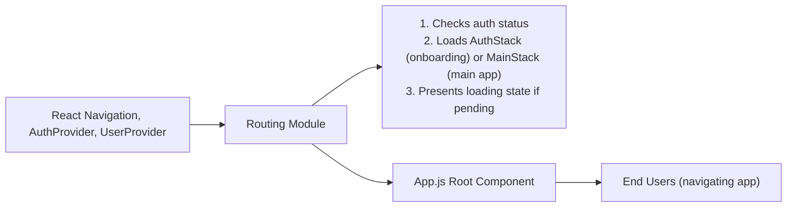

# Routing Module

## Overview
The Routing module manages navigation flow within the app, dynamically presenting authentication or main content routes based on the user's authentication state. It provides a consistent mechanism for moving between authentication screens (e.g., Sign In/Sign Up) and the primary user experience (e.g., Home, Browse, Profile). By leveraging React Navigation, this module ensures users are always directed to the appropriate part of the app, improving both security, user onboarding, and experience.

## Key Features
- **Conditional Navigation Flow**: Automatically switches between Authentication and Main navigation stacks depending on whether the user is logged in.
- **Authentication Stack (AuthStack)**: Groups onboarding and sign-in related screens (e.g., FirstScreen, SignUp, SignIn), presenting them only to unauthenticated users.
- **Main Stack (MainStack)**: Provides a tabbed interface for authenticated users, with quick access to primary app features like Home, Browse, and Profile.
- **Seamless User Experience**: Ensures loading and authentication transitions (e.g., loading spinner while auth state resolves).
- **Navigation State Isolation**: Keeps AuthStack and MainStack navigation flows separate, preventing unauthorized access to main app screens.

## System Errors
- **Loading State Stuck**: If authentication status is not resolved (e.g., due to a network error), the loading spinner may persist.
  - *Resolution*: Check connectivity and ensure authentication provider resolves the state; handle persistent loading in the AuthProvider context.
- **Navigation Fallback Error**: If a route name is misspelled or missing, navigation may fail silently or throw an error.
  - *Resolution*: Verify route names in both stacks match those registered and that screens exist.
- **Invalid Auth Context**: If AuthProvider or UserProvider is not properly initialized, navigation logic may not work as intended.
  - *Resolution*: Ensure providers wrap the NavigationContainer as in the App root.

## Usage Examples

```jsx
// App.js - Core setup integrating Routing module

import { NavigationContainer } from '@react-navigation/native';
import { AuthProvider, useAuth } from './context/AuthContext';
import MainStack from './component/Navigation/MainStack';
import AuthStack from './component/Navigation/AuthStack';
import { UserProvider } from './context/UserContext';

export default function App() {
  return (
    <AuthProvider>
      <UserProvider>
        <NavigationContainer>
          <AppNavigator />
        </NavigationContainer>
      </UserProvider>
    </AuthProvider>
  );
}

// AppNavigator automatically chooses between AuthStack and MainStack
const AppNavigator = () => {
  const { currentUser, loading } = useAuth();

  if (loading) {
    return <ActivityIndicator size="large" />;
  }

  return currentUser ? <MainStack /> : <AuthStack />;
};
```

## System Integration


