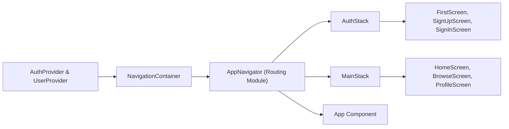

# Routing Module

## Overview
The Routing Module orchestrates navigation flows within the application. It determines whether users are directed to the authentication flow or the main application flow based on their authentication state. Built with React Navigation, it integrates AuthStack for sign-in/up screens and MainStack for the core tab-based interface, all wrapped within essential context providers.

## Key Features
- **Dynamic Flow Switching**: Automatically routes users to AuthStack when unauthenticated and to MainStack once authentication is confirmed.
- **AuthStack**: Native stack navigator handling:
  - FirstScreen
  - SignUpScreen
  - SignInScreen
- **MainStack**: Bottom tab navigator providing:
  - HomeScreen (Home icon)
  - BrowseScreen (Browse icon)
  - ProfileScreen (Profile icon)
- **Context Integration**: Leverages AuthProvider and UserProvider to supply authentication state and user data throughout navigation.
- **Loading State Handling**: Displays a full-screen ActivityIndicator while the authentication state is initializing.

## System Errors
- **Missing NavigationContainer**  
  Description: Navigation state will not function without a NavigationContainer wrapper.  
  Resolution: Ensure `<NavigationContainer>` wraps the root navigator in App.js.
- **Undefined currentUser or loading**  
  Description: Occurs when AuthContext is not properly provided or initialized.  
  Resolution: Verify that `<AuthProvider>` is placed above components consuming `useAuth()`.
- **Invalid Screen Name**  
  Description: Passing a non-existent screen name to a Navigator leads to runtime errors.  
  Resolution: Confirm that `name` props in `Screen` components match the imported screen component names.

## Usage Examples
```javascript
// App.js
import React from 'react';
import { View, ActivityIndicator } from 'react-native';
import { NavigationContainer } from '@react-navigation/native';
import { AuthProvider, useAuth } from './context/AuthContext';
import { UserProvider } from './context/UserContext';
import AuthStack from './component/Navigation/AuthStack';
import MainStack from './component/Navigation/MainStack';
import { createNativeStackNavigator } from '@react-navigation/native-stack';

const Stack = createNativeStackNavigator();

function AppNavigator() {
  const { currentUser, loading } = useAuth();

  if (loading) {
    return (
      <View style={{ flex:1, justifyContent:'center', alignItems:'center' }}>
        <ActivityIndicator size="large" />
      </View>
    );
  }

  return (
    <Stack.Navigator screenOptions={{ headerShown: false }}>
      {currentUser ? (
        <Stack.Screen name="Main" component={MainStack} />
      ) : (
        <Stack.Screen name="Auth" component={AuthStack} />
      )}
    </Stack.Navigator>
  );
}

export default function App() {
  return (
    <AuthProvider>
      <UserProvider>
        <NavigationContainer>
          <AppNavigator />
        </NavigationContainer>
      </UserProvider>
    </AuthProvider>
  );
}
```

```javascript
// component/Navigation/AuthStack.js
import React from 'react';
import { createNativeStackNavigator } from '@react-navigation/native-stack';
import FirstScreen from '../../screens/FirstScreen';
import SignUpScreen from '../../screens/SignUpScreen';
import SignInScreen from '../../screens/SignInScreen';

export default function AuthStack() {
  const Stack = createNativeStackNavigator();
  return (
    <Stack.Navigator initialRouteName="FirstScreen" screenOptions={{ headerShown: false }}>
      <Stack.Screen name="FirstScreen" component={FirstScreen} />
      <Stack.Screen name="SignUp" component={SignUpScreen} />
      <Stack.Screen name="SignIn" component={SignInScreen} />
    </Stack.Navigator>
  );
}
```

## System Integration
