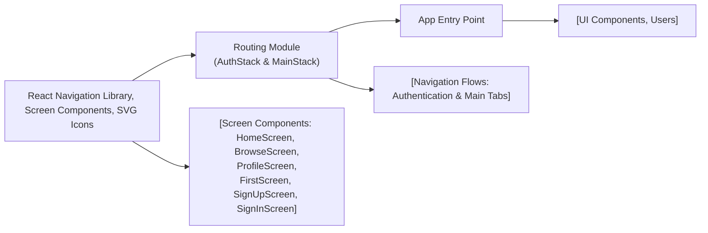

# Routing

## Overview

The routing module organizes and manages navigation flows within the app, providing two main navigation stacks:
- **AuthStack**: Handles onboarding and authentication screens for unauthenticated users.
- **MainStack**: Handles the primary app interface for authenticated users, using a tab navigation pattern.

This routing setup ensures the correct screens are shown to users based on their authentication state and enables navigation between core sections of the app.

## Key Features

- **Authentication Stack (`AuthStack`)**:  
  Provides a stack-based navigation for authentication-related screens: Welcome, Sign Up, and Sign In. Used when users are not authenticated.

- **Main Application Stack (`MainStack`)**:  
  Offers a persistent tab-based navigation for main app features (Home, Browse, Profile). Used after successful authentication.

- **Screen Organization**:  
  Separates authentication flows from main content, improving user experience and maintainability.

- **Icon Integration**:  
  Each main tab has an associated SVG icon for a visual and intuitive navigation experience.

## System Errors

- **Incorrect Initial Route Name**:  
  If a route defined in `initialRouteName` does not match any registered screen, navigation will fail to display the intended opening screen.
  - *Resolution*: Verify that `initialRouteName` matches one of the provided `name` props in navigator screens.

- **Screen Component Import Errors**:  
  If a screen is incorrectly imported or missing, navigation will result in a blank screen or runtime error.
  - *Resolution*: Ensure all referenced screen components (`FirstScreen`, `SignUpScreen`, `SignInScreen`, `HomeScreen`, `BrowseScreen`, `ProfileScreen`) exist and are correctly imported.

## Usage Examples

```javascript
import { NavigationContainer } from '@react-navigation/native';
import AuthStack from './component/Navigation/AuthStack';
import MainStack from './component/Navigation/MainStack';

// Example: Switch stacks based on authentication status
function AppNavigation({ isAuthenticated }) {
    return (
        <NavigationContainer>
            {isAuthenticated ? <MainStack /> : <AuthStack />}
        </NavigationContainer>
    );
}
```

## System Integration

