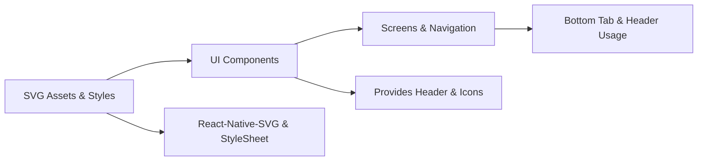

# UI Components

## Overview
The UI Components module centralizes reusable visual elements—such as headers and navigation icons—used across the application. It ensures consistent styling and simplifies integration with navigation and screen components.

## Key Features
- **Header**: A flexible top bar component with predefined height and background color. Used for screen titles or navigation controls.
- **BrowseIcon**: SVG-based search icon for browse or search screens.
- **HomeIcon**: SVG-based home icon for main or landing screens.
- **ProfileIcon**: SVG-based user icon for profile or account screens.

## System Errors
- **Missing react-native-svg dependency**: Occurs when rendering SVG icons without installing or linking `react-native-svg`.  
  Resolution: Install with `yarn add react-native-svg` and follow linking instructions if needed.
- **Invalid import path**: Happens when importing components or icons with incorrect relative paths.  
  Resolution: Verify the path under `component/Reusable/Header.js` for Header and `assets/icons/*.svg` for icons.
- **SVG loader misconfiguration**: Icons fail to render if Metro bundler isn’t configured for SVG.  
  Resolution: Add an appropriate SVG transformer (e.g., `react-native-svg-transformer`) and update `metro.config.js`.

## Usage Examples
```javascript
// Importing and rendering the Header
import React from 'react';
import Header from '../component/Reusable/Header';

export default function MyScreen() {
  return (
    <>
      <Header />
      {/* Screen content here */}
    </>
  );
}
```

```javascript
// Using SVG icons in a bottom tab navigator
import React from 'react';
import { createBottomTabNavigator } from '@react-navigation/bottom-tabs';
import HomeScreen from './HomeScreen';
import BrowseScreen from './BrowseScreen';
import ProfileScreen from './ProfileScreen';
import HomeIcon from '../assets/icons/Home.svg';
import BrowseIcon from '../assets/icons/Browse.svg';
import ProfileIcon from '../assets/icons/Profile.svg';

const Tab = createBottomTabNavigator();

export default function AppNavigator() {
  return (
    <Tab.Navigator>
      <Tab.Screen
        name="Home"
        component={HomeScreen}
        options={{
          tabBarIcon: ({ color, size }) => (
            <HomeIcon width={size} height={size} fill={color} />
          ),
        }}
      />
      <Tab.Screen
        name="Browse"
        component={BrowseScreen}
        options={{
          tabBarIcon: ({ color, size }) => (
            <BrowseIcon width={size} height={size} fill={color} />
          ),
        }}
      />
      <Tab.Screen
        name="Profile"
        component={ProfileScreen}
        options={{
          tabBarIcon: ({ color, size }) => (
            <ProfileIcon width={size} height={size} fill={color} />
          ),
        }}
      />
    </Tab.Navigator>
  );
}
```

## System Integration
