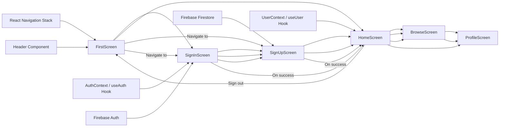

# UI Components

## Overview
The UI Components module provides reusable React Native components and screens used throughout the Expo-Firebase Boilerplate. These components create the basic user interface for authentication, navigation, profile management, and content browsing. The module is foundational for the app's look and feel, offering users a consistent and interactive experience.

## Key Features

- **Header Component**: Displays a simple header text, usable at the top of various screens to maintain visual consistency.
- **FirstScreen**: Serves as the application's welcome/landing screen, offering entry points to Sign Up and Sign In workflows.
- **HomeScreen**: Shows authenticated user information and enables sign-out functionality, acting as the main dashboard after login.
- **SignInScreen**: Provides a user interface for user authentication with email and password fields, error handling, and navigation to password reset and sign-up flows.
- **SignUpScreen**: Allows new users to create an account by collecting relevant information and handling sign-up validation and error feedback.
- **BrowseScreen**: Placeholder screen intended for browsing content and navigation demonstrations.
- **ProfileScreen**: Placeholder for displaying or editing user profile information.

## System Errors

- **Authentication Errors**:
  - `auth/invalid-credential`: Triggered on SignIn when the email/password is incorrect. Resolution: User should verify credentials; an error message is shown.
  - `auth/email-already-in-use`: Occurs during SignUp when the email is already registered. Resolution: User should use another email; shown in SignUp error field.
  - `auth/invalid-email`: Occurs if the provided email is not valid. Resolution: User needs to correct the email format.
  - `auth/weak-password`: Triggered if the password is less than 6 characters. Resolution: User is prompted to choose a stronger password.
- **Validation Errors**:
  - Missing required fields (email, password, first name, last name). Resolution: Inline error messages are displayed for each invalid or empty field.
- **General Navigation Errors**:
  - Navigation reset or transition failures (rare, usually due to misconfiguration or missing routes). Resolution: Ensure all navigational destinations (e.g., "Main", "Auth") exist in your navigation stack.

## Usage Examples

```javascript
// Using FirstScreen as the entry point in navigation
import FirstScreen from './screens/FirstScreen';

<Stack.Screen name="Welcome" component={FirstScreen} />

// Using HomeScreen after user is authenticated
import HomeScreen from './screens/HomeScreen';

<Stack.Screen name="Home" component={HomeScreen} />

// Using SignInScreen and SignUpScreen for authentication flows
import SignInScreen from './screens/SignInScreen';
import SignUpScreen from './screens/SignUpScreen';

<Stack.Screen name="SignIn" component={SignInScreen} />
<Stack.Screen name="SignUp" component={SignUpScreen} />

// Reusing the Header component on any screen
import Header from './component/Reusable/Header';

function AnyScreen() {
  return (
    <View>
      <Header />
      {/* ...rest of the screen */}
    </View>
  );
}
```

## System Integration

