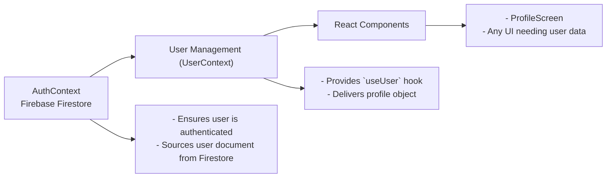

# User Management

## Overview
The **User Management** module enables the application to provide authenticated user profile data to all components in a consistent and efficient manner. It ensures that profile information stays synchronized with the backend database (Firebase Firestore) and makes user data available to any component that requires it, supporting both authentication-aware UI and user-specific operations.

## Key Features
- **Centralized User Profile Context**: Provides a React Context (`UserContext`) that exposes the active user's profile and UID across the component tree.
- **Realtime Profile Synchronization**: Listens to changes in the user's Firestore document and instantly updates the local profile state when data on the backend changes.
- **Simple Consumption via Hook**: Exposes the `useUser` hook for easy access to user profile data in any React component.
- **Dependency on Authentication State**: Automatically manages user data based on the authentication status (from `useAuth`), connecting and disconnecting listeners as needed to ensure current and correct data.

## System Errors
- **User Not Found**:  
  _Description_: If the current user's document is missing in Firestore, the system logs "No such user!" to the console, and the profile state remains empty.  
  _Resolution_: Ensure that user documents are correctly created in your Firestore database at registration or onboarding.

- **Firestore Connectivity Issues**:  
  _Description_: If the app cannot connect to Firestore (e.g., due to network errors), real-time updates may fail, and profile data may not remain up to date.  
  _Resolution_: Check network status, Firebase configuration, and ensure required permissions are set in Firestore rules.

## Usage Examples

```javascript
// Example: Consuming the user profile in a React Native component

import React from 'react';
import { Text } from 'react-native';
import { useUser } from '../context/UserContext';

export default function WelcomeBanner() {
  const { profile } = useUser();

  if (!profile.uid) return <Text>Loading...</Text>;

  return <Text>Welcome, {profile.displayName || "User"}!</Text>;
}
```

```javascript
// Example: Wiring the provider at the root of your app

import React from 'react';
import { UserProvider } from '../context/UserContext';

export default function App() {
  return (
    <UserProvider>
      {/* rest of the app (e.g., Navigation, Screens) */}
    </UserProvider>
  );
}
```

## System Integration


