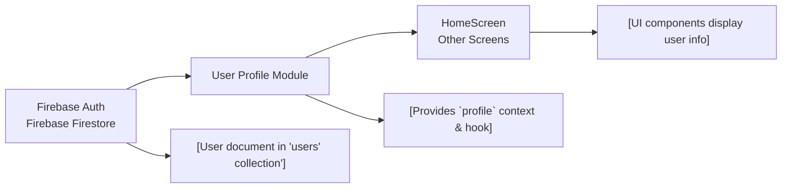

# User Profile Module

## Overview
The User Profile module centralizes access to user profile data for authenticated users. It provides real-time synchronization between the Firebase Firestore user document and the React context, exposing an up-to-date user profile to all child components. This enables client screens like Home and Profile to display or use user-specific information without manual data fetching.

## Key Features
- **Profile Context Provider**: Supplies the entire app (or the subtree wrapped by the provider) with access to the authenticated user's profile via React context.
- **Real-time Sync with Firestore**: Automatically listens for changes to the user’s Firestore document and updates the profile in real-time, ensuring data freshness.
- **Profile Hook (`useUser`)**: Simple hook that allows any component to access the current profile, abstracting away the data fetching and listening details.

## System Errors
- **Missing User Document**: If the authenticated user's document does not exist in Firestore:
  - *Description*: The context will log "No such user!", and the profile will remain empty.
  - *Resolution*: Ensure that the user document is created in Firestore upon registration or first login.
- **Not Authenticated**: If no user is authenticated:
  - *Description*: The profile context provides an empty object.
  - *Resolution*: Components should check for the presence of expected profile fields before rendering user-specific content.

## Usage Examples

```javascript
// Wrap your app (or a subtree) with the provider
import { UserProvider } from './context/UserContext';

export default function App() {
  return (
    <UserProvider>
      {/* ... your navigation/screens */}
    </UserProvider>
  );
}

// Access profile in a component
import { useUser } from './context/UserContext';

function ProfileHeader() {
  const { profile } = useUser();
  if (!profile.FirstName) {
    return <Text>Loading...</Text>;
  }
  return <Text>Welcome, {profile.FirstName} {profile.LastName}!</Text>;
}
```

## System Integration


