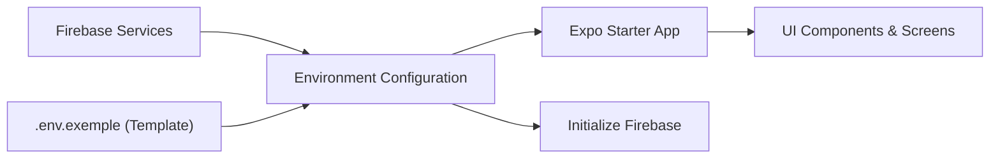

# Environment Configuration

## Overview
The Environment Configuration module centralizes the setup and loading of Firebase credentials for the Expo-Firebase Boiler Plate. It reads from a `.env` file (based on the provided `.env.exemple` template), validates required keys, and exposes them at runtime via Expo Constants. This ensures credentials are not hard-coded and can be switched easily per environment (development, staging, production).

## Key Features
- **Credential Loading**: Automatically parses `.env` to populate Firebase configuration fields: APIKEY, PROJECTID, AUTHDOMAIN, STORAGEBUCKET, MESSAGINGSENDERID, APPID.
- **Environment Isolation**: Supports multiple environment files (e.g., `.env.development`, `.env.production`) to segregate credentials and settings.
- **Validation**: Checks for missing or empty values on startup to catch misconfigurations early.
- **Expo Integration**: Uses `expo-constants` to securely inject variables into the application without exposing them in source code.

## System Errors
- **MissingVariableError**  
  Description: A required environment variable (e.g., `APIKEY`) is undefined or empty.  
  Resolution: Copy `.env.exemple` to `.env` at project root, fill in all keys with valid values from your Firebase console, and rebuild the app.

- **InvalidVariableFormat**  
  Description: An environment variable value does not match the expected format (for example, a malformed `APPID`).  
  Resolution: Verify the variable value directly in the Firebase project settings and update the `.env` file accordingly.

## Usage Examples
```bash
# At project root, create your .env based on the template
cp .env.exemple .env
# Open .env and fill in the Firebase project values
```

```javascript
// App.js
import Constants from 'expo-constants';
import { initializeApp } from 'firebase/app';

// Read Firebase config from Expo Constants
const firebaseConfig = {
  apiKey: Constants.manifest.extra.APIKEY,
  authDomain: Constants.manifest.extra.AUTHDOMAIN,
  projectId: Constants.manifest.extra.PROJECTID,
  storageBucket: Constants.manifest.extra.STORAGEBUCKET,
  messagingSenderId: Constants.manifest.extra.MESSAGINGSENDERID,
  appId: Constants.manifest.extra.APPID,
};

// Initialize Firebase with loaded credentials
const firebaseApp = initializeApp(firebaseConfig);

export default firebaseApp;
```

## System Integration
