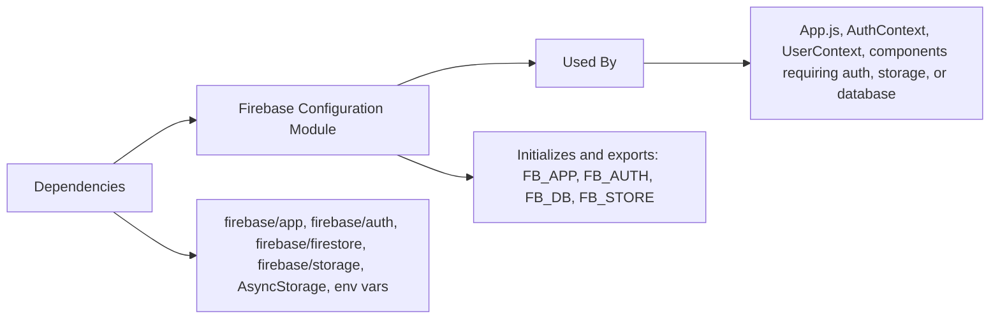

# Firebase Configuration Module

## Overview
This module initializes and configures Firebase services for the Expo React Native application. It provides ready-to-use instances for authentication, Firestore database, and file storage, partnering with React Native AsyncStorage for secure session persistence. This configuration is foundational for enabling user authentication, data storage, and media management throughout the app.

## Key Features

- **Firebase Core Initialization**: Sets up the Firebase App using project environment variables, ensuring secure and environment-specific configurations.
- **Authentication with Persistence**: Initializes Firebase Authentication with React Native AsyncStorage, enabling persistent user sessions even after app restarts.
- **Firestore Database Access**: Provides a pre-configured Firestore instance for scalable and real-time data management.
- **Cloud Storage Access**: Offers a pre-configured Storage instance for managing media files and documents within the app.
- **Centralized Exports**: Exposes all core services (`FB_APP`, `FB_AUTH`, `FB_DB`, `FB_STORE`) for easy and consistent import across the codebase.

## System Errors

- **Invalid Configuration Error**: If environment variables (e.g., APIKEY, AUTHDOMAIN) are missing or incorrect, Firebase initialization may fail.
  - *Resolution*: Ensure all required Firebase project variables are correctly set in the environment. Consult your Firebase console for accurate keys.
- **Persistence Error**: If AsyncStorage is incorrectly linked or unavailable, authentication persistence will not work.
  - *Resolution*: Verify AsyncStorage is properly installed and linked. Re-install or link if necessary.
- **Network/Permission Errors**: Occur when trying to access Firestore or Storage without proper project permissions or Internet connectivity.
  - *Resolution*: Check Firebase project permissions and device/network status.

## Usage Examples

```javascript
// Import Firebase services where needed
import { FB_AUTH, FB_DB, FB_STORE } from './firebaseconfig';

// Example: Sign In with Email & Password
import { signInWithEmailAndPassword } from 'firebase/auth';
signInWithEmailAndPassword(FB_AUTH, 'user@example.com', 'password123');

// Example: Write Data to Firestore
import { doc, setDoc } from 'firebase/firestore';
await setDoc(doc(FB_DB, "users", "userId123"), { name: "Alice" });

// Example: Upload File to Cloud Storage
import { ref, uploadBytes } from 'firebase/storage';
const storageRef = ref(FB_STORE, 'profile/userId123/avatar.jpg');
await uploadBytes(storageRef, fileBlob);
```

## System Integration


