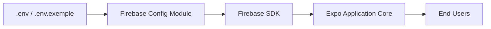

# Expo Firebase Boiler Plate FAQ

## Overview
This FAQ module provides answers to common questions and integration concerns when setting up and using the Expo Firebase Boiler Plate. It helps users understand how key modules interact and how to troubleshoot frequent configuration and runtime issues.

## Key Features
- **Environment Variable Guidance**: Clarifies the purpose and usage of the `.env.exemple` file for environment setup.
- **Firebase Integration Support**: Explains how and when Firebase services are initialized and used within the boilerplate.
- **Project Configuration Assistance**: Provides context for setting up your Firebase project and aligning your environment variables.

## System Errors
- **Missing Environment Variables**: If required variables (e.g., `APIKEY`, `PROJECTID`) are missing, Firebase initialization will fail.  
  **Resolution**: Copy `.env.exemple` to `.env`, fill in values from your Firebase console, and restart the project.
- **Invalid Firebase Project Settings**: Errors during authentication or data fetching often indicate misalignment between environment values and your Firebase project.  
  **Resolution**: Double-check keys in Firebase project settings. Ensure no trailing spaces or extra characters in `.env`.
- **Network or Permissions Errors**: Problems with storage or messaging may stem from insufficient Firebase rules.  
  **Resolution**: Update your Firebase Firestore and Storage security rules appropriately in the Firebase console.

## Usage Examples

```bash
# 1. Copy and configure environment variables
cp .env.exemple .env
# Edit .env and fill in values from your Firebase Project settings

# 2. Install dependencies
yarn install
# or
npm install

# 3. Start your Expo project
expo start

# 4. The boilerplate will now initialize Firebase services based on your configuration.
```

## System Integration

