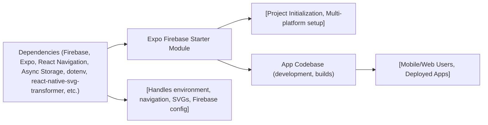

# Expo Firebase Starter – Getting Started

## Overview
This starter module provides a pre-configured Expo React Native boilerplate with integrated Firebase support. It streamlines the setup process for new mobile and web projects by bundling essential navigation, environment handling, and SVG/image asset management. The goal is to give developers a robust foundation that follows best practices and is ready for feature development and deployment on multiple platforms.

## Key Features
- **Firebase Integration**: Includes the official Firebase SDK pre-installed for seamless cloud-based backend features such as authentication, Firestore, and storage.
- **Expo-First Workflow**: Full support for Expo CLI and services, including multi-platform (iOS, Android, web) development and bundled asset management.
- **Navigation System**: Built-in React Navigation with bottom tabs and native stack navigators for scalable routing.
- **Environment Variable Support**: Uses `react-native-dotenv` and `dotenv` for secure and flexible management of configuration settings.
- **SVG Asset Handling**: Configured support for importing and transforming SVG assets directly as components within React Native.
- **Async Storage**: Built-in async storage support for persistent local data.

## System Errors
It's important to document common errors and troubleshooting specifics:
- **Metro Bundler SVG Import Error**: If you encounter errors importing SVG files, ensure Metro config is set up as shown and that the `react-native-svg-transformer` package is installed. Restart the dev server after changes.
- **Environment Variable Not Found**: If environment variables are undefined, check that your `.env` file exists, is named correctly, and that the Babel config matches your usage. Restart the server after editing configs.
- **Firebase Initialization Issues**: If Firebase services fail to initialize, confirm you have properly configured your Firebase project's settings in your code and environment files.

## Usage Examples
Practical code examples showing how to use the module:

```javascript
// Import Firebase as configured
import { initializeApp } from "firebase/app";
import { FIREBASE_API_KEY } from "@env";

// Initialize Firebase
const firebaseConfig = {
  apiKey: FIREBASE_API_KEY,
  // ...other Firebase options from @env
};
const app = initializeApp(firebaseConfig);

// React Navigation example (App.js)
import { NavigationContainer } from '@react-navigation/native';
import { createBottomTabNavigator } from '@react-navigation/bottom-tabs';

const Tab = createBottomTabNavigator();

export default function App() {
  return (
    <NavigationContainer>
      <Tab.Navigator>
        {/* Your screens here */}
      </Tab.Navigator>
    </NavigationContainer>
  );
}

// SVG Import example
import Logo from './assets/logo.svg';

<Logo width={120} height={40} />
```

## System Integration

