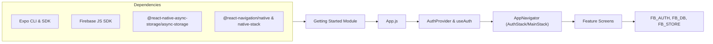

# Getting Started

## Overview
This document explains how to set up and initialize the Expo-Firebase Boiler Plate. The boiler plate provides a ready-to-use React Native project with:
- Expo tooling and scripts  
- Firebase services (Authentication, Firestore, Storage)  
- React Navigation and context-based user flows  

By following these steps, you’ll have a working foundation to build a mobile application with authentication, data storage, and navigation in place.

## Key Features
- **Environment Configuration**: Use a `.env` file to store Firebase credentials securely.  
- **Firebase Initialization**: Preconfigured `firebaseconfig.js` to initialize Firebase App, Auth with React Native persistence, Firestore, and Storage.  
- **Auth Context**: Provides `AuthProvider` and `useAuth` hooks to manage user sessions and loading state.  
- **User Context**: `UserProvider` to share user-specific data across components.  
- **Conditional Navigation**: Automatically switches between authentication and main app flows based on user status.  
- **Expo Scripts**: Predefined scripts in `package.json` for starting the app on Android, iOS, or web.

## System Errors
- **Missing .env File**  
  Description: Firebase credentials are not loaded (undefined).  
  Resolution: Copy `.env.exemple` to `.env` at the project root and fill in the required values (`APIKEY`, `AUTHDOMAIN`, `PROJECTID`, etc.). Restart the Metro bundler.  

- **Invalid Firebase Configuration**  
  Description: “Firebase: Error (auth/invalid-api-key)” or similar errors in logs.  
  Resolution: Double-check `.env` values match your Firebase console settings. Ensure `react-native-dotenv` is configured in `babel.config.js` if you’re using it.  

- **AsyncStorage Persistence Failures**  
  Description: Authentication state does not persist after app restart.  
  Resolution: Verify you have `@react-native-async-storage/async-storage` installed and linked. Ensure `initializeAuth` in `firebaseconfig.js` is using `getReactNativePersistence(AsyncStorage)`.

## Usage Examples
1. Clone the repository and install dependencies:
   ```shell
   git clone https://github.com/lucasboucher/Expo-Firebase-Boiler-Plate.git
   cd Expo-Firebase-Boiler-Plate
   npm install
   ```
2. Configure environment variables:
   ```shell
   cp .env.exemple .env
   # Open .env and fill in your Firebase project credentials
   ```
3. Run the app on your target platform:
   ```shell
   npm run android   # for Android emulator/device
   npm run ios       # for iOS simulator/device
   npm run web       # for web preview
   ```
4. Entry point (`App.js`) usage:
   ```javascript
   import React from 'react';
   import { NavigationContainer } from '@react-navigation/native';
   import { AuthProvider } from './context/AuthContext';
   import { UserProvider } from './context/UserContext';
   import AppNavigator from './AppNavigator';

   export default function App() {
     return (
       <AuthProvider>
         <UserProvider>
           <NavigationContainer>
             <AppNavigator />
           </NavigationContainer>
         </UserProvider>
       </AuthProvider>
     );
   }
   ```

## System Integration
