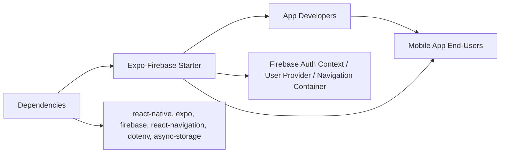

# Getting Started with TheChallengeApp Boilerplate

## Overview
This starter project provides a pre-configured Expo + Firebase boilerplate for rapid development of React Native mobile apps. It integrates Firebase authentication, database, and storage, leverages react-navigation for navigation stacks, and uses environment-based configuration. The architecture is set up to help you quickly bootstrap a new cross-platform app while handling user authentication and data persistence securely.

## Key Features

- **Expo Integration**: Quick setup and hot-reloading for faster development on Android, iOS, and Web.
- **Firebase Initialization**: Pre-configured Firebase App, Authentication, Firestore, and Storage, with secure environment-variable driven setup.
- **Authentication Provider**: Context-based auth flow handling (login, signup, persistence), with automatic navigation between unauthenticated (AuthStack) and authenticated (MainStack) states.
- **React Navigation**: Out-of-the-box navigation with stack navigators for both authenticated and unauthenticated flows.
- **Async Storage Persistence**: Uses @react-native-async-storage/async-storage to persist Firebase authentication state across app restarts.
- **Environment Variable Management**: Securely manage API keys and credentials via dotenv and react-native-dotenv.

## System Errors

- **Missing/Invalid Environment Variables**:  
  If environment variables for Firebase config (`APIKEY`, `AUTHDOMAIN`, etc.) are not set or misconfigured, the app will fail to initialize Firebase, possibly resulting in runtime errors or blank screens.  
  **Resolution**: Ensure a proper `.env` file exists with all required credentials, and that babel and dotenv are correctly configured.

- **Firebase Initialization Failure**:  
  Errors during Firebase setup (e.g., invalid config, network issues) may cause the app to hang or crash on load, especially during authentication state resolution.  
  **Resolution**: Confirm Firebase project settings and network connectivity. Check logs for specific errors.

- **Authentication State Not Persisted**:  
  If AsyncStorage is not available (e.g., corrupted install), users may be logged out unexpectedly.  
  **Resolution**: Reinstall or update `@react-native-async-storage/async-storage`.

- **Navigation Not Working**:  
  If navigation dependencies are missing or mismatched, users may not see the correct screens.  
  **Resolution**: Run `npm install` or `yarn install` and ensure all navigation packages are at compatible versions.

## Usage Examples

```javascript
// .env (DO NOT check into version control)
APIKEY=your_firebase_api_key
AUTHDOMAIN=your_project.firebaseapp.com
PROJECTID=your_project_id
STORAGEBUCKET=your_project.appspot.com
MESSAGINGSENDERID=your_sender_id
APPID=your_app_id
```

```javascript
// App.js - Entry point: No changes needed for typical use
export default function App() {
  return (
    <AuthProvider>
      <UserProvider>
        <NavigationContainer>
          <AppNavigator />
        </NavigationContainer>
      </UserProvider>
    </AuthProvider>
  );
}
```

```javascript
// firebaseconfig.js - Access Firebase services from anywhere in your app
import { FB_AUTH, FB_DB, FB_STORE } from './firebaseconfig';

// Example: Using Firestore
import { collection, getDocs } from 'firebase/firestore';
const querySnapshot = await getDocs(collection(FB_DB, 'users'));
querySnapshot.forEach((doc) => {
  console.log(doc.id, '=>', doc.data());
});
```

```javascript
// Package management
npm install   # or yarn install
npm run start # Starts Expo in development mode
```

## System Integration


